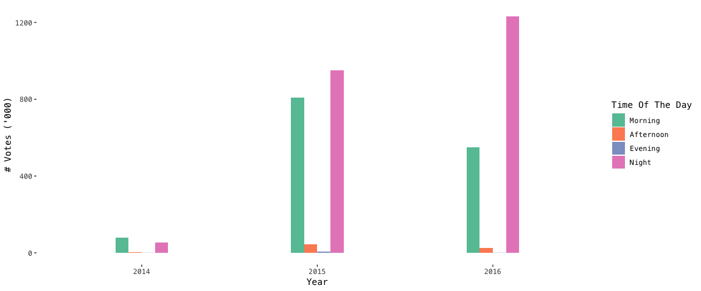

README
================

## 背景

**[Product Hunt](https://www.producthunt.com/)** （以下简称 PH ）
是一个为用户提供共享和发现新产品的网站，而你是一名商业分析师,
任职于国内某大型互联网企业数据科学部门。 每天，大量的科技爱好者会通过 PH
了解科技产品新趋势。这一次你通过 Product Hunt API
获取到了关于 PH 平台用户及其发布的帖子等相关信息，希望通过数据分析帮助运营部门提出更有效的推广方案。

## 数据探索

#### 1 针对主题的探索

PH 上涵盖了各式各样的主题，从网页科技至生活效率小贴士。各个主题所积累的帖子数量也不一致。你好奇是不是发布的帖子越多，主题所累积的追随者
(`num_followers`) 也越多。 于是你针对发布数量最多的前20大帖子主题进行了探索。发现帖子数量和主题的追随人数没有明显的关联性。

<!-- -->

#### 2 针对帖子发布时间的探索

贴子的投票数量 (`votes_count`)
是衡量该帖子受欢迎程度的重要指标。基于你对网上用户浏览行为特征的了解，你假设不同的发布时间会直接影响帖子的受欢迎程度。经过探索，你发现在早、晚两个时间段发布的帖子明显积累更多的票数。

提示: 如何从时间类别(`dttm`)解析年份
`?lubridate::year()`

<!-- -->

#### 3 搜索科技产品触觉达人

运营部门希望招纳一名科技牛人成为体验专家，提供产品或者运营的改善建议。以获得的平均投票数量来衡量，他们希望知道哪些用户所发布的帖子最能得到其他用户的认可。你筛选了发布超过30个帖子的用户，按照帖子所得投票数的均值（累计的总投票数除于发布的帖子数）选出了前20名发布者。

<!-- -->

#### 4 哪些主题更受用户青睐

你想初步了解 PH
的用户画像。具体地说，在受到欢迎的帖子中，哪些主题频繁地出现？你筛选在整体投票数中位数以上的帖子，汇总各个主题出现的次数。你删除了
`tech` 主题，因为它没有太大的代表性。最后你总结出了前10大主题。

提示：如何转换宽表至长表 `?tidyr::gather()`

<!-- -->
