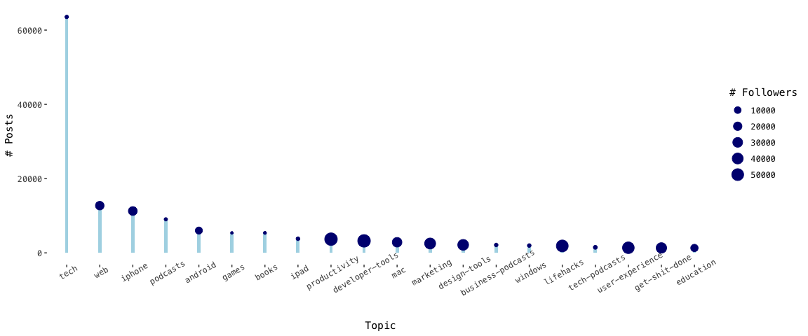
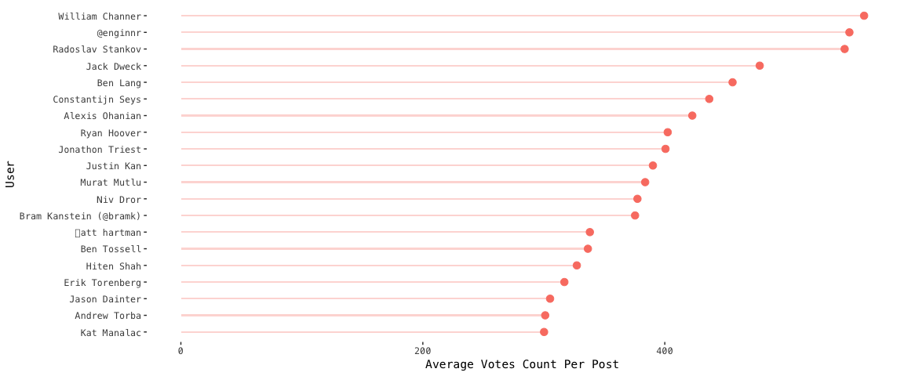
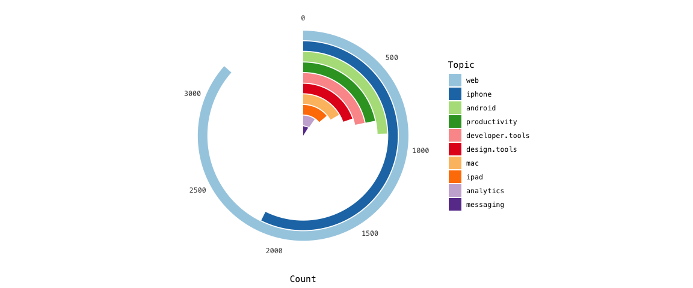

README
================

## 背景

**[Product Hunt](https://www.producthunt.com/)** （以下简称 PH ）
是一个允许用户共享和发现新产品的网站，而你是一名商业分析师,
任职于国内某大型互联网数据科学部门。 大量科技爱好者会通过
PH了解科技产品趋势。这一次你通过 Product Hunt API 调度了大量关于帖子以及发布者的信息，
希望通过数据分析帮助运营部门提出更有效的推广方案。

## 数据探索

#### 1 针对主题的探索

PH 上涵盖了各式各样的主题，从网页至效率小贴士。各个主题里所发布的帖子数量也不一致。你好奇是不是发布的帖子越多， 主题所累积的追随者
(`num_followers`) 也越多。 于是你针对发布帖子数量最多的前20主题进行了探索。
发现发布帖子的数量和其主题的追随人数没有明显的关联性。

<!-- -->

#### 2 针对帖子发布时间的探索

贴子的投票数量 (`votes_count`) 是衡量帖子受认可程度的重要指标。基于你对网上用户游览作息的了解，
你假设不同的发布时间会对帖子受欢迎程度有直接的影响。你发现在早上以及晚上发布的帖子明显积累更多的票数。

提示:
如何从时间类别(`dttm`)解析年份

``` r
?lubridate::year()
```

<!-- -->

#### 3 搜索科技产品触觉达人

运营部门希望招纳一名科技牛人成为体验专家，提供产品或者运营的建议。以投票数衡量，他们希望知道哪些人发布的帖子最收到平台用户的认可。你删选发布超过30个帖子的用户，按照帖子投票数的均值（累计的总投票数除于发布的帖子数）选出了20个人选。

<!-- -->

#### 4 哪一些主题收到用户青睐

你想初步了解 PH 的用户画像。具体地说，在受到欢迎的帖子中，哪些主题频繁出现？你删选在投票数中位数以上的帖子，汇总各个主题出现的次数。你删除了
`tech` 主题，因为它没有太大的代表性。最后你总结出了10大主题。

提示：如何转换宽表至长表

``` r
?tidyr::gather()
```

<!-- -->
